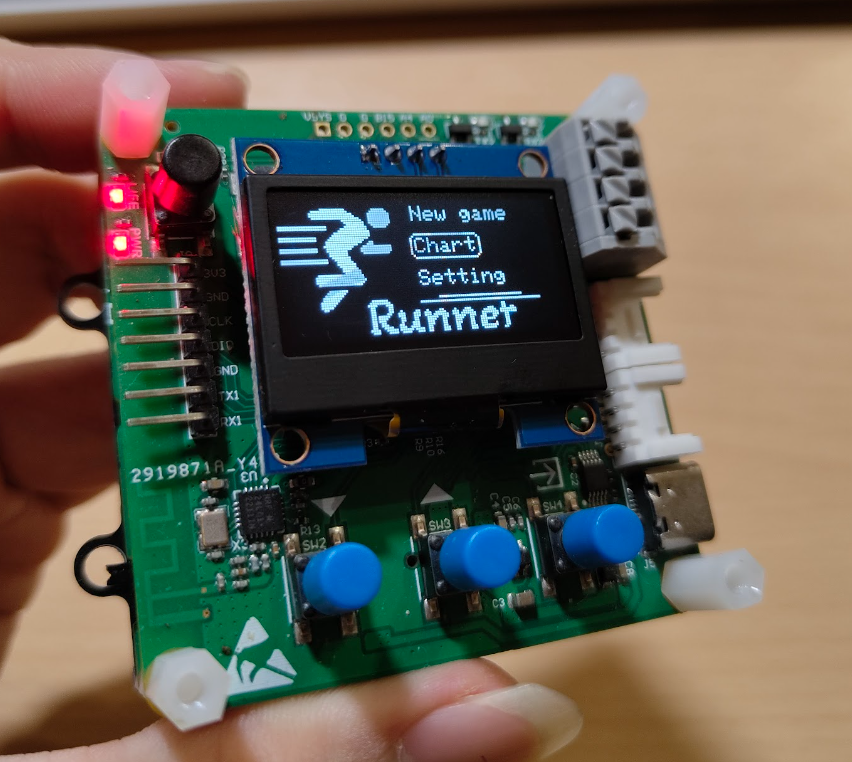
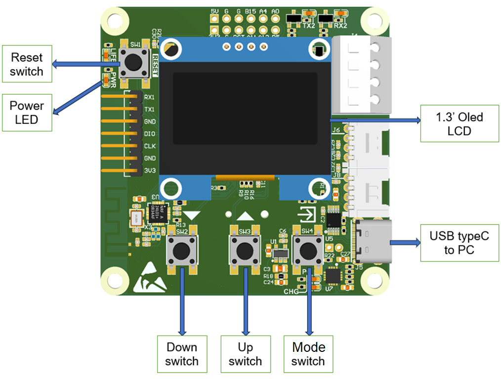
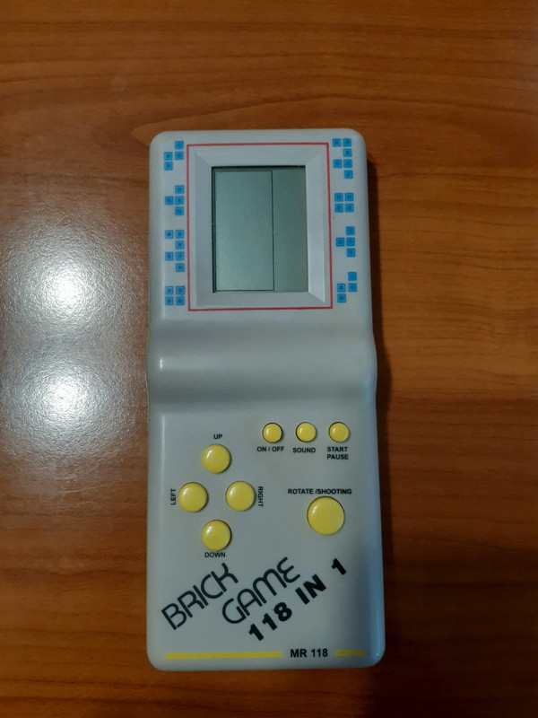

# Runner-game built on AK-base-kit


This game was created with implementation of [AK-mOS(mini RTOS)](https://github.com/snoopy3921/AK-mOS---The-simple-RTOS-on-AK-base-kit) and **Oled GUI(Graphic user interface)**. With the purpose to test, learn and pratice the use of Event-driven-based with tasks. 

The development of [AK-mOS](https://github.com/snoopy3921/AK-mOS---The-simple-RTOS-on-AK-base-kit) and **Oled GUI** are being updated, with will be released in the future.

See [AK Base Kit](https://epcb.vn/products/ak-embedded-base-kit-lap-trinh-nhung-vi-dieu-khien-mcu) for more information 

## I. Intro
The kit is pretty cool, which has 3 buttons, 1 buzzer and 1 Oled 1.3" display. Those are enough for game development like any other kit such as [Arduboy](https://www.arduboy.com/),...



Not only that, the kit but also has RS485, NRF24L01+, and External Flash 32MB suitable for application prototypes in embedded systems or uses such as: wired communication, wireless communication, data logger storage applications, multiple application loader,...

## II. About game
To be honest im not a gaming guy. So to think the game i like and make it as we have been playing on retro game console like this, i cant remember.



But at least i like playing FPS game(Valorant, CSGO,...). The idea is making a running game but make it FPS :))). I see the guy made his [Evasion game](https://community.arduboy.com/t/evasion-a-simple-action-game/9226) and i want to make it too.

### 2.1 Interfaces
We have 3 button - UP, DOWN, MODE.

+ UP and DOWN are used to navigate, in menu screens is used to go up and down. In game screen, use to turn left and right.

+ MODE is used to select, hold MODE to exit from screens.

### 2.2 About game
Turn left and turn right to evade the columns. Every step you have gone is your score. Game has 3 fixed speed modes but the way to calculate score is the same. So it is one chart for all modes.

|Object|Description|
|---|---|
|**Column**|Move to you every step|
|**Star**|Effect, make the game more realistic|
|**Player view**|Not visible, can move to left or right|

### 2.3 Objects
+ A column has of course width and height, depth(distance from column to player view), and 1 object of GUI to draw rectangular which takes 3 params(width, height and fade(the farther the blurrier))

+ A star has only height(width = 1), depth and 1 obj of GUI to draw a dot.

+ Player has step width and step depth(these params are fixed). Every time player steps, the attributes of stars and columns are recalculated, that make the feel moving in 3D space.

## III. Tasks
The AK-mOS **task** is independent, it has its own **message queue**. Because its independant, the private stack is required for every task, with big task - big stack size. Any task that listens to message needs message queue to store message to process. Task with no message queue can normally send message to other tasks.

Some important aspects of task:
+ **Event Handling**: Tasks are used to handle messages fired when an event occurs. Each task can be associated with a specific event and execute a series of actions when that event occurs.
+ **Synchronization**: Tasks provide a synchronization mechanism for handling events. When an event occurs, the corresponding task is triggered and executed. Other tasks will wait until the current task completes before being triggered. This helps ensure that event handling actions are performed in a certain order and avoid conflicts.
+ **Control Flow Management**: Tasks allow event flow management in event-driven applications. By using tasks, you can determine the order of execution of actions when different events occur.
+ **Logic Separation**: Using tasks helps separate event handling logic, which makes the Source code clear and easy to read.
+ **Task hierarchy**: Task level allows to arrange the priority order of processing task messages in the system queue. 
+ **Avoid blocking fucntion**: With application using GUI, the GUI need to be placed in seprated task. GUI every interval of time will refresh display, it will block other task if tasks are not prioritized and separated. This application places GUI at lowest priority.

This is list of all tasks in application:
|Task ID|Task Handle|Task priority|Message queue size|Stack size|
|---|---|---|---|---|
|TASK_BTN_ID|task_btn|0|0|100|
|TASK_BUZZER_ID|task_buzzer|1|8|100|
|TASK_TIMER_ID|task_timer|2|8|100|
|TASK_SCR_ID|task_scr|3|16|250|
|TASK_GUI_ID|task_gui|4|0|150|

To understand this easier, i will describle from high priority to low. **(Task with lower number get highest priority).**

+ NOTE: Task with same priority can also run in round-robin schem.

### 3.1 Task button
Task button has highest prio, in order to not missing any event from user.**(I want it to turn left, but it ignore me!)**

Task button using ***button driver***, to init buttons, first it calls: 

``` C
/* button init */
button_init(&btn_mode,	10,	BUTTON_MODE_ID,	io_button_mode_init,	io_button_mode_read,	btn_mode_callback);
button_init(&btn_up,	10,	BUTTON_UP_ID,	io_button_up_init,	io_button_up_read,	btn_up_callback);
button_init(&btn_down,	10,	BUTTON_DOWN_ID,	io_button_down_init,	io_button_down_read,	btn_down_callback);

button_enable(&btn_mode);
button_enable(&btn_up);
button_enable(&btn_down);
```
And then poll state of buttons at every 10ms:
``` C
void task_btn(void *p_arg)
{
    while(1)
    {
        button_timer_polling(&btn_mode);
        button_timer_polling(&btn_up);
        button_timer_polling(&btn_down);
        os_task_delay(10);
    }
}
```
If any of these button has an event (PRESSED, REALEASED, LONG PRESSED), associated funtion will be invoked and send signal to **Task screen**(described later).

``` C
void btn_mode_callback(void* b) {
	button_t* me_b = (button_t*)b;
	switch (me_b->state) {
	case BUTTON_SW_STATE_PRESSED: {
        os_task_post_msg_pure(TASK_SCR_ID, AC_DISPLAY_BUTTON_MODE_PRESSED);
	}
		break;

	case BUTTON_SW_STATE_LONG_PRESSED: {
		os_task_post_msg_pure(TASK_SCR_ID, AC_DISPLAY_BUTTON_MODE_LONG_PRESSED);
	}
		break;

	case BUTTON_SW_STATE_RELEASED: {
		os_task_post_msg_pure(TASK_SCR_ID, AC_DISPLAY_BUTTON_MODE_RELEASED);
	}
		break;

	default:
		break;
	}
}
```

### 3.2 Task buzzer
Task buzzer does not run frequently, so it has prio high afer the highest.

Task buzzer using ***buzzer driver***, to init buzzer, first it calls: 

``` C
BUZZER_Init();
```

And then in task it looks like:
``` C
void task_buzzer(void *p_arg)
{
    msg_t *msg;
    int32_t sig = OS_CFG_DELAY_MAX - 1;

    while (1)
    {   
        msg = os_task_wait_for_msg(sig);
        if(msg != NULL) 
        {
            sig = msg->sig;
            os_msg_free(msg);
        }
        
        if(sig != OS_CFG_DELAY_MAX) 
        {
            switch (sig)
            {
            case AC_BUZZER_PLAY_TONE_MOVE:
                play_track(tones_USB_dis);
                break;
            case AC_BUZZER_PLAY_TONE_DEATH:
                play_track(tones_startup);
                break;
            default:
                break;
            }
            sig = OS_CFG_DELAY_MAX - 1;
        }
    }
}
```
This task will wait indefinitely for signal to decided which tone to play. These signals come from **Task screen** when player turns left or right or when game is over.


### 3.3 Task Timer
Task timer runs more frequently than task buzzer, so it has prio after **task buzzer**

Task time has message queue to wait for signals. Signal that this task need is the interger number determine interval to send message to update screen.
```C
void task_timer(void *p_arg)
{
    msg_t *msg;
    int32_t sig = OS_CFG_DELAY_MAX - 1;

    while (1)
    {   
        msg = os_task_wait_for_msg(sig);
        if(msg != NULL) 
        {
            sig = msg->sig;
            os_msg_free(msg);
        }
        if(sig != OS_CFG_DELAY_MAX - 1) 
        {
            os_task_post_msg_pure(TASK_SCR_ID, AC_DISPLAY_GAME_UPDATE);
        }
    }
}
```

### 3.4 Task Screen
Task screen manage all screens in this application including:
+ Start-up screen:

+ Menu game screen:

+ Chart game scree:

+ Setting game screen:

+ Main game screen:

Task screen takes message queue size of 16. These signals below are what this task receives and sends:

``` C
/* define signal */
enum {
	AC_DISPLAY_BUTTON_MODE_PRESSED = 1,						
	AC_DISPLAY_BUTTON_MODE_LONG_PRESSED,					
	AC_DISPLAY_BUTTON_MODE_RELEASED,
	AC_DISPLAY_BUTTON_UP_PRESSED,							
	AC_DISPLAY_BUTTON_UP_LONG_PRESSED,					
	AC_DISPLAY_BUTTON_UP_RELEASED,
	AC_DISPLAY_BUTTON_DOWN_PRESSED,						
	AC_DISPLAY_BUTTON_DOWN_LONG_PRESSED,					
	AC_DISPLAY_BUTTON_DOWN_RELEASED,
	AC_DISPLAY_GAME_UPDATE
};

/* define signal */
enum {
	AC_BUZZER_PLAY_TONE_MOVE = 1,		
	AC_BUZZER_PLAY_TONE_DEATH				
};
```
Signals start with **AC_DISPLAY_BUTTON_...** are sent from **Task button**.

**AC_DISPLAY_GAME_UPDATE** is sent from **Task timer**.

Signals start with **AC_BUZZER_...** are sent from this task to **Task buzzer** to play tones.

### 3.5 Task GUI
Task GUI using OLED GUI(is being developed) first call gui_init() to init oled display, obj of gui chain, ... And then call gui_run() to update objects and refresh display whenever it has a chance to run.

gui_init() is called before [AK-mOS](https://github.com/snoopy3921/AK-mOS---The-simple-RTOS-on-AK-base-kit) initialization to save task GUI's stack size.

Task GUI takes no message.

``` C
void task_gui(void *p_arg)
{
    while(1)
    {
        gui_run();
    }
}
```

## IV. Sequence diagram
For better understand, the sequence diagram is given below:

